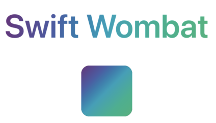

# How to create a custom ViewModifier

@Metadata {
    @PageImage(purpose: card, source: how-to-create-custom-viewmodifier)
}

As an outcome of this tutorial, you will learn how to make a foreground gradient modifier that you can apply to any view to get an effect like the one on the screenshot below.

##



Making User Interface (UI) with SwiftUI combines three activities:

- you will be creating new and arranging existing Views,
- modifying the State of your app,
- and transforming Views to new ones using ViewModifiers (or just modifiers for short).

I'll explain how you can make your modifiers by combining others, ready to use ViewModifiers to achieve the third step quicker and in a more efficient way.

The best way to create a custom modifier is to write View code first and then extract (refactor) the given part. If you look through SwiftUI documentation, you will find a modifier to apply a gradient to the background (its name is just the `background`). Still, there is not similar functionality for the foreground.To apply a gradient to the foreground, you have to use overlay and mask modifiers.

```swift
// To make it more readable in next code snipets,
// I'll be using `gradient` as it declared somwhere else.
let gradient = LinearGradient(
    gradient: Gradient(colors: [
            Color(red: 0.427, green: 0.196, blue: 0.486),
            Color(red: 0.282, green: 0.365, blue: 0.651),
            Color(red: 0, green: 0.631, blue: 0.729),
            Color(red:0.00392, green:0.694, blue:0.557),
            Color(red: 0.196, green:0.702, blue:0.482)
        ]
    ),
    startPoint: .topLeading,
    endPoint: .bottomTrailing
)

var body: some View {
    Text("Swift Wombat")
        .overlay(gradient)
        .mask(Text("Swift Wombat"))
}
```

As you can see, in this case, it looks a bit corny. I have to duplicate the Text view to make it works.

You can do better with a modifier. Create a new file with a struct and ensure that it implements the ViewModifier protocol.

```swift
import SwiftUI

struct ForegroundGradient: ViewModifier {    
    func body(content: Content) -> some View {
        // ...
    }
}
```

The content parameter on body function provides you a view that the given modifier is applied to. You can move that simple solution code here to it. By extracting gradient parameter, you will have a more versatile solution.

```swift
import SwiftUI

struct ForegroundGradient: ViewModifier {    
    let gradient: LinearGradient
    
    func body(content: Content) -> some View {
        content
            .overlay(gradient)
            .mask(content)
    }
}
```

Right now, you can apply the newly created ViewModifier to any view using the modifier function.

```swift
Text("Swift Wombat")
    .modifier(ForegroundGradient(gradient: gradient))
```

But you can do even better. You probably notice that you are not using any of the know modifiers that way. Apple added convenience View extensions to apply them. You can do the same with this short code snippet.

```swift
public extension View {
    func foregroundGradient(_ gradient: LinearGradient) -> some View {
        modifier(ForegroundGradient(gradient: gradient))
    }
}
```

The whole `ForegroundGradient.swift` file will look like this:

```swift
import SwiftUI

struct ForegroundGradient: ViewModifier {
    let gradient: LinearGradient
    
    func body(content: Content) -> some View {
        content
            .overlay(gradient)
            .mask(content)
    }
}

public extension View {
    func foregroundGradient(_ gradient: LinearGradient) -> some View {
        modifier(ForegroundGradient(gradient: gradient))
    }
}
```

And now you can apply foreground gradient to your views with one simple line of code:

```swift
 Text("Swift Wombat")
    .foregroundGradient(gradient)
    
 RoundedRectangle(cornerRadius: 16)
    .frame(width: 100, height: 100)
    .foregroundGradient(gradient)
```


Want to test it yourself? Download this [repository](https://github.com/kamilpowalowski/swiftwombat-webpage/).

@Small { 2020-12-20 16:27 }
